# Introduction

This worksheet provides an introduction to APIs. In it we introduction some basic API concepts and provide some exercises you can do using the Flickr API with Google Sheets. Supporting slides if needed are at: [go.alt.ac.uk/machina-slides](http://go.alt.ac.uk/machina-slides)  

*This document was developed by Martin Hawksey (@mhawksey) and distributed under a [Creative Commons Attribution 4.0 License](http://creativecommons.org/licenses/by/4.0/) based on content developed by Owen Stephens on behalf of the British Library and also released under CC-BY at [http://www.meanboyfriend.com/overdue_ideas/2014/10/using-an-api-hands-on-exercise/](http://www.meanboyfriend.com/overdue_ideas/2014/10/using-an-api-hands-on-exercise/)*  

# What is an API?

An API is essentially an interface that can be used by a computer programme to retrieve or interact with another application. Many popular online services offer such interfaces, like Facebook, Twitter, Flickr and many Google services such as Google Maps and Google Book Search offer APIs which are used by a wide range of services.

[CC-BY Developed by Owen Stephens on behalf of the British Library](http://www.meanboyfriend.com/overdue_ideas/wp-content/uploads/2014/10/4-APIs-CC-BY.pdf)

# Using APIs

APIs come in many flavours and each one will usually have it’s own documentation to help you use it. Before using API’s there are some basic concepts you should be familiar with. Most APIs are used by sending a request to a URL. URLs have a number of components, identified below, which are useful to know when you are working with APIs:

Image:  CC-BY drmikeh  [https://git.io/vdh2h](https://git.io/vdh2h)  

In the case of APIs we often need to send data as parameters (also known as ‘query string parameters’ or sometimes as 'arguments’). Parameters are started in a URL with a question mark, ‘`?`’. The format of parameters is not standardised but in general the form is the parameter name followed by the value separated by an equals sign, ‘`=`’. In the example above the parameter `q` has the value facebook. If we want to use multiple parameters these are usually separated by a ampersand, '`&`'. The order of parameters in a url is not important. 

**Example** 

`https://www.google.co.uk/search?q=facebook&sourceid=chrome&ie=UTF-8`

<table>
  <tr>
    <td>Parameter</td>
    <td>Value</td>
  </tr>
  <tr>
    <td><code>q</code></td>
    <td><code>facebook</code></td>
  </tr>
  <tr>
    <td><code>sourceid</code></td>
    <td><code>chrome</code></td>
  </tr>
  <tr>
    <td><code>ie</code></td>
    <td><code>UTF-8</code></td>
  </tr>
</table>

# Exercise 1: Using the Flickr Feeds API

In this exercise we are going to use the Flickr public photos and videos feed API to return a list of tagged photos in a Google Sheet. When learning about new APIs it is good practice to start with the documentation to understand how you can use the API. In the case of the public photos and feeds API the documentation is at [https://www.flickr.com/services/feeds/docs/photos_public/](https://www.flickr.com/services/feeds/docs/photos_public/) 

In the documentation the following information is included:

>**Public feed**
>Returns a list of public content matching some criteria.
>
> **URL** `https://api.flickr.com/services/feeds/photos_public.gne`
>
>**Query string parameters**
>
>`id` (Optional) - 
A single user ID. This specifies a user to fetch for.
>
>`ids` (Optional) - 
A comma delimited list of user IDs. This specifies a list of users to fetch for.
>
>`tags` (Optional) - 
A comma delimited list of tags to filter the feed by.
>
>`tagmode` (Optional) - 
Control whether items must have ALL the tags (tagmode=all), or ANY (tagmode=any) of the tags. Default is ALL.
>
>`format` (Optional) -
The format of the feed. See the feeds page for feed format information. Default is Atom 1.0.
>
>`lang` (Optional) - The display language for the feed. See the feeds page for feed language information. Default is US English (en-us).

The important information you need to use this API is the URL and knowing which parameters you can use with it. Notice that all the parameters are optional - try opening the API url [https://api.flickr.com/services/feeds/photos_public.gne](https://api.flickr.com/services/feeds/photos_public.gne).  You should see data for the last 20 photos uploaded to Flickr. 

Here are some example API calls we can do:

**Example - Flickr content tagged ‘mozfest’**:

`https://api.flickr.com/services/feeds/photos_public.gne?tags=mozfest` 

**Example - Flickr content tagged ‘mozfest’ in rss2 format**:

`https://api.flickr.com/services/feeds/photos_public.gne?tags=mozfest&format=rss2`

## Using the Flickr Public Feed API

To use the API we are going to use a Google Sheet to collect the data in a form we can reuse. We will also setup the spreadsheet in a way that it is easy for you to play with different parameter values. To do this go to [https://drive.google.com](https://drive.google.com) and login to your Google account. Create a new Google Sheet

The first thing to do is use the sheet cells to build the API call (the query you are going to submit to the API). To do this copy and paste the following table into your sheet:

<table>
  <tr>
    <td><b>URL</b></td>
    <td><code>https://api.flickr.com/services/feeds/photos_public.gneM</code></td>
  </tr>
  <tr>
    <td><b>id</b></td>
    <td></td>
  </tr>
  <tr>
    <td><b>ids</b></td>
    <td></td>
  </tr>
  <tr>
    <td><b>tags</b></td>
    <td>mozfest</td>
  </tr>
  <tr>
    <td><b>tagmode</b></td>
    <td></td>
  </tr>
  <tr>
    <td><b>format</b></td>
    <td>rss2</td>
  </tr>
  <tr>
    <td><b>lang</b></td>
    <td></td>
  </tr>
  <tr>
    <td><b>API Call</b></td>
    <td></td>
  </tr>
</table>

Your sheet should look like the image below (**Note:** Our URL cell is in A2, the first row being empty):

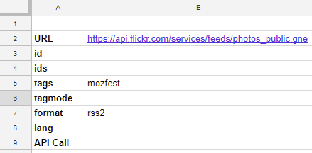

In the sheet we have added the API url and then all the optional parameters, in this case specifying that we wish to return results for photos with the `tags` equal to `mozfest` and the `format` in `rss2`.

You now have all the parameters we need to build the API call. To do this you want to create a URL very similar to the one you looked at above. As adding the required & and = can be error prone we are going to use some Google Sheet formula to help us. In the sheet cell C3 add the following formula:

`=IF(B3<>"",JOIN("=",A3:B3),"")`

With this formula if cell B3 is blank  it joins the values in A3 and B3 together with a `=`. **Note: **On entering this formula the result will be blank as there is nothing in cell B3. 

Selecting the cell with the formula (C3) copy it then select the cells C4 to C8 and paste. This should copy the formula into the other parameter rows.

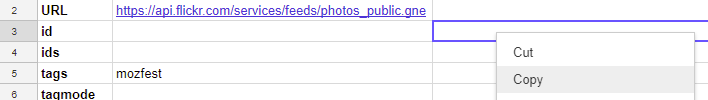

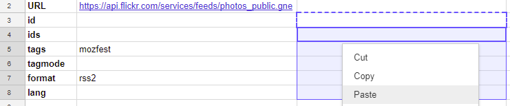

Your sheet should now look like this:

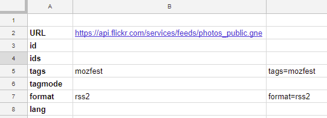

To make the full API call add the following formula to cell B9:

`=B2 & "?" & JOIN("&",FILTER(C3:C8, C3:C8<>""))`

This formula takes the value from B2 (our 'API URL') and adds the text `?`, it then joins the values which are not blank in cells C3 to C8 with `&`. After the formula is entered you should see the following result:

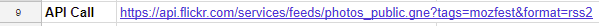

The final part of this exercise is to make the call to the API and get the data into our Google Sheet. To do this we are going to use the `IMPORTFEED` formula. You can read more about this and other ‘import’ formulas at [https://support.google.com/docs/answer/3093337](https://support.google.com/docs/answer/3093337).   

In cell A11 enter the following formula:

`=IMPORTFEED(B9)` 

This takes our API call url and returns the data into the cells. When the formula is entered you should have something that looks like this:

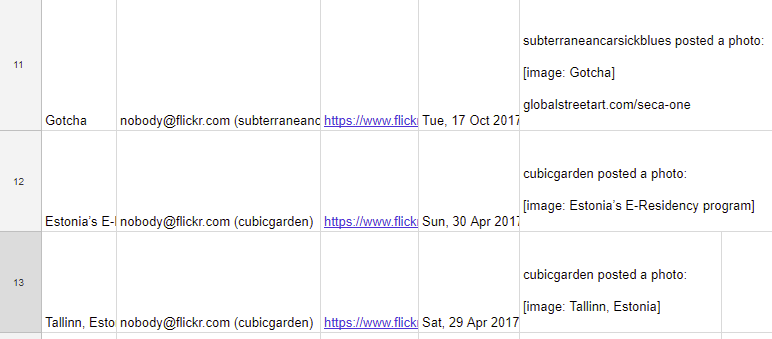

Modify some of the parameter values in your sheet to see what happens to the result. For example, in cell B7 change the format to some of these values listed on the [feed formats documentation](https://www.flickr.com/services/feeds/):

* `atom`
* `rss`
* `rss_091`
* `rdf`
* `rss_200_enc`

## Limitations of `IMPORTFEED` 

In this exercise when the `IMPORTFEED`  formula was entered in cell A11 it added data to cells A11 to E30. If you try operations like sorting or inserting rows/columns the formula might break or reinsert data in the row/column you inserted. There are various Google Sheet tutorials you can find for ways of manipulating data like this one on [import and query](https://mashe.hawksey.info/2012/10/feeding-google-spreadsheets-exercises-in-import/#h.5989xuog6lsc).  

The data in these cells is also not stored permanently. When new data is available in the Flickr photos feed for our API call only the 20 most recent items will appear in our Google Sheet and any existing data is overwritten.

## Exploring other Flickr Feeds API options

As part of the [Flickr Feeds API documentation](https://www.flickr.com/services/feeds/) there are other APIs you might want to explore listed below:

* [Public photos & video](https://www.flickr.com/services/feeds/docs/photos_public/)
* [Friends' photostream](https://www.flickr.com/services/feeds/docs/photos_friends/)
* [Public favorites from a user](https://www.flickr.com/services/feeds/docs/photos_faves/)
* [Group discussions](https://www.flickr.com/services/feeds/docs/groups_discuss/)
* [Group pools](https://www.flickr.com/services/feeds/docs/groups_pool/)
* [Forum discussions](https://www.flickr.com/services/feeds/docs/forums/)
* [Recent activity on your photostream](https://www.flickr.com/services/feeds/docs/activity/)
* [Recent comments you made](https://www.flickr.com/services/feeds/docs/photos_comments/)

You can use the same Google Sheet template as used in this exercise remembering to change the URL and parameters used in each of these.

# Exercise 2: Using the main Flickr API to make a Mozfest photo timeline 

So far we have used the Flickr Feeds API as a starting point. In this exercise we are going to use the main Flickr API. This API has more options about what and how much data is returned. We will use this data to make an interactive timeline of Flickr photos tagged ‘mozfest’ similar to the one shown below:

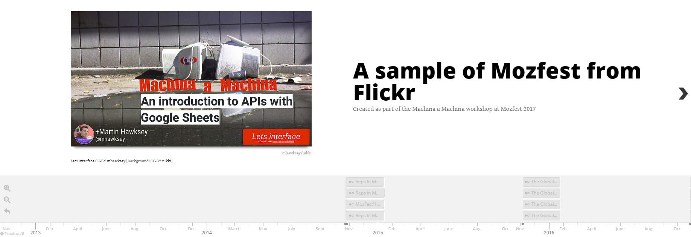

On the [Flickr API documentation homepage](https://www.flickr.com/services/api/) there are over 200 ‘API Methods’ listed: 

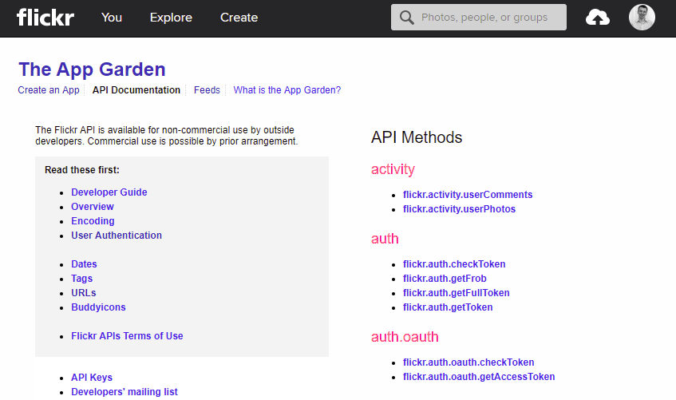

The amount of data to can access is extensive and not just photos and can include the profile of who took the photo, where they took it, comments and more.

In this exercise we will again look at fetching photos with a specific tag and viewing them in a Google Sheet, learning more API techniques along the way.

In this exercise we will mostly be using the flickr.photos.search API method which is documented here: [https://www.flickr.com/services/api/flickr.photos.search.html](https://www.flickr.com/services/api/flickr.photos.search.html) and an extract is below:

>**flickr.photos.search**
>
>Return a list of photos matching some criteria. Only photos visible to the calling user will be returned. To return private or semi-private photos, the caller must be authenticated with 'read' permissions, and have permission to view the photos. Unauthenticated calls will only return public photos.
>
>**Authentication**
>
>This method does not require authentication.
>
>**Arguments**
>
>`api_key` (Required) - 
Your API application key. See here for more details.
>
> `user_id` (Optional) - 
The NSID of the user who's photo to search. If this parameter isn't passed then everybody's public photos will be searched. A value of "me" will search against the calling user's photos for authenticated calls.
>
>`tags` (Optional) - 
A comma-delimited list of tags. Photos with one or more of the tags listed will be returned. You can exclude results that match a term by prepending it with a - character.
>
>\+ 33 more parameters /...

Some of this will look familiar to the Feeds API we used earlier, in particular, the inclusion of the tags parameter. This time the documentation page doesn’t give a url for our API call for this we have to look at the main [Flickr API documentation](https://www.flickr.com/services/api/) page for information about ‘Request Formats’. Generally the easiest format is REST, which Flickr supports. From the [Flickr REST Request Format page](https://www.flickr.com/services/api/request.rest.html) it states:

>**REST Request Format**
>
> REST is the simplest request format to use - it's a simple HTTP GET or POST action.
>
>The REST Endpoint URL is `https://api.flickr.com/services/rest/`
>
> To request the flickr.test.echo service, invoke like this:
>
> `https://api.flickr.com/services/rest/?method=flickr.test.echo&name=value`

So for the flickr.photos.search our API call would include:

`https://api.flickr.com/services/rest/?method=flickr.photos.search&api_key=...`

If you are interested in finding out more about REST Mozilla have more info/links at [https://developer.mozilla.org/Glossary/REST](https://developer.mozilla.org/Glossary/REST)   

## API Access/Authentication

The flickr.photos.search documentation page also mentions authentication and states that one of the parameters, api_key, is required. As authentication is not required to get public photos we won’t be covering it in this exercise, but if you start using APIs more it is an area you’ll probably have to learn about. 

API keys are similar to authentication in that they are used by API services to restrict/control access and monitor usage of APIs. Creation of API keys is also often tied to a user account with the service, which is the case for Flickr. Use of the Flickr API is limited to noncommercial unless you get consent from Flickr and other APIs will usually have  their own 'terms of service'. If you have a Flickr account to can find out more about [getting an API key](https://www.flickr.com/services/api/misc.api_keys.html), but for the purposes of this exercise a key is provided.    

## Using the flickr.photos.search API

In this exercise we are going to use Google Sheets again setup in a similar way to Exercise 1. As this API has so many parameters a template is provided for you to get started. If you visit [https://goo.gl/EDQ12t](https://goo.gl/EDQ12t) a copy will be created for you (this includes a completed Exercise 1). You should have a sheet that looks like this:

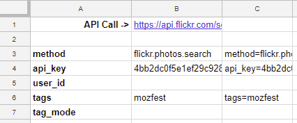

Opening the link in cell B2 will let you see the data we get. Depending on the browser you use you should see something similar to this:

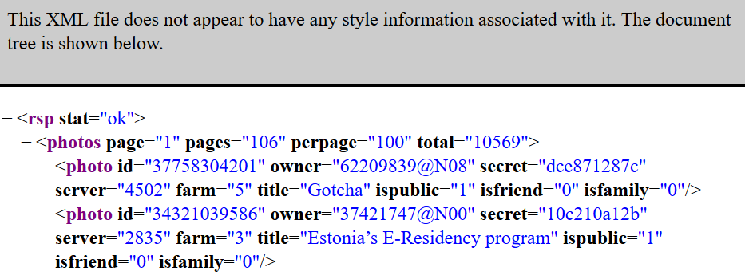

By default the Flickr API returns data in an XML format. XML is essentially the mother of HTML, but is more flexible as it is not constrained by a preset of tags you get in HTML. In this example you can see a `photo` tag is used with data about the photo stored in attributes like ‘`id`’, ‘`owner`’, ‘`secret`’ and so on (if you are interested in finding out more about XML Mozilla have this starting point [https://developer.mozilla.org/Glossary/XML](https://developer.mozilla.org/Glossary/XML)). 

To extract data from the XML we have to ‘parse’ it – that is, tell a computer how to extract data from this structure. One way of doing this is using ‘XPath’. XPath is a way of writing down a route to data in an XML document.

The simplest type of XPath expression is to list all the elements that are in the ‘path’ to the data you want to extract using a ‘/’ to separate the list of elements. This is similar to how ‘paths’ to documents are listed in a file system.

In the document structure above, the XPath to the title is:

`/rsp/photos/photo/@title`

The ‘`@`’ is an attribute operator which lets you select the ‘`title`’ value from the  `photo` tag. There are various tools that can help you view and construct XPaths and more information on these is available from [https://developer.mozilla.org/Web/XPath](https://developer.mozilla.org/Web/XPath). 

In this exercise we are going to use the Code Beautify XML Viewer [https://codebeautify.org/xmlviewer](https://codebeautify.org/xmlviewer). Opening this site you are able to click the ‘Load Url’ button and copy/paste the API Call url from cell B2 of your spreadsheet: 

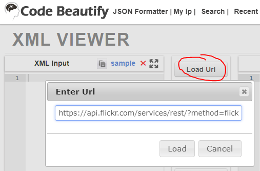

Once the data has loaded it should make it easier for you to see the XPath structure and the  ‘`@`’ attributes. 

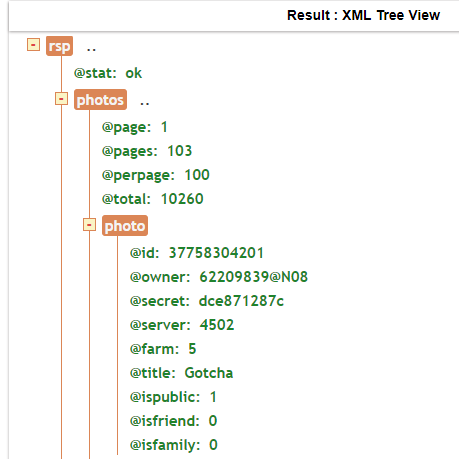

To access this data in Google Sheets we are going to use the `IMPORTXML` formula. This is similar to the `IMPORTFEED` formula but gives more control accessing data. To use `IMPORTXML` we need to provide a url and XPath query. To try this in cell E3 of your spreadsheet enter the formula:

`=IMPORTXML(B1,"/rsp/photos/photo/@title")`

This should return a list of titles similar to this:

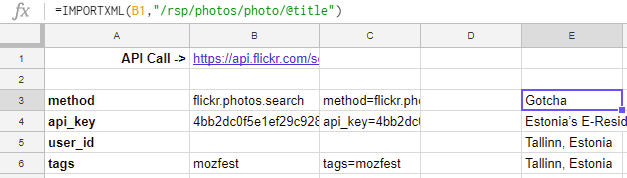

To get more data than just the title we can add more `IMPORTXML` formula. To keep track of which column has which data it is good practice to add a header to them. We can also use the header to make it easier to copy/paste and get other photo attributes. To do this in cell E2 add the text `title` and in cell E3 change the formula to:

`=IMPORTXML($B$1,"/rsp/photos/photo/@"&E2)`

Here we are using `$` the to lock onto the cell B1 so it doesn't change bwhen we copy and paste, and referencing cell E2 for the attribute we want returned. Once you have done this add the following column names in cells F2 and G2:

<table>
  <tr>
    <td><b>owner</b></td>
    <td><b>id</b></td>
  </tr>
</table>

You can now also select cell E3 and copy/paste it into cells F3 and G3.

 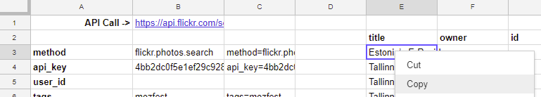

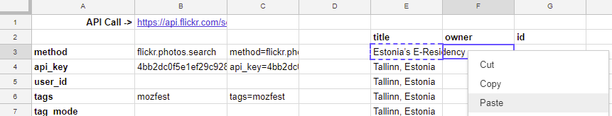

You should now have a spreadsheet that looks like this:

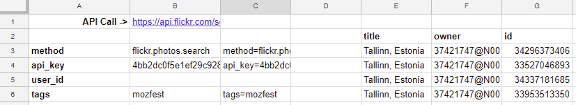

Experiment with other `tags` values to see what happens to the data in the columns.

To make our timeline we want to refine the call we make to the Flickr API. The documentation lists a number of optional parameters. For this exercise we are interested in the following:

>**per_page** (Optional)
>
>Number of photos to return per page. If this argument is omitted, it defaults to 100. The maximum allowed value is 500.

The API call defaults to 100 photos but by adding `500` in column B for the row with `per_page` we can get more: 

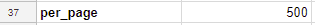

> **extras** (Optional)
>
> A comma-delimited list of extra information to fetch for each returned record. Currently supported fields are: `description`, `license`, `date_upload`, `date_taken`, `owner_name`, `icon_server`, `original_format`, `last_update`, `geo`, `tags`, `machine_tags`, `o_dims`, `views`, `media`, `path_alias`, `url_sq`, `url_t`, `url_s`, `url_q`, `url_m`, `url_n`, `url_z`, `url_c`, `url_l`, `url_o`

This API also lets us specify additional data to be included with each item. For the purposes of our timeline let's add `date_taken,owner_name` to column B for the row with `extras`:

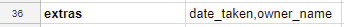

>**sort** (Optional)
>
>The order in which to sort returned photos. Defaults to `date-posted-desc` (unless you are doing a radial geo query, in which case the default sorting is by ascending distance from the point specified). The possible values are: `date-posted-asc`, `date-posted-desc`, `date-taken-asc`, `date-taken-desc`, `interestingness-desc`, `interestingness-asc`, and `relevance`.

Flickr has an option to return photos sorted in different orders. For our timeline in column B for the `sort` row add `date-posted-desc` (**Note:** when developing this exercise I tried options for `interestingness-desc` and `relevance` but for working in Google Sheets this doesn’t work as the results change every time to make the API call. As a result as we are using multiple `IMPORTXML` formula the data for each row goes out of sync).

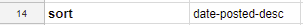

>**license** (Optional)
>
>The license id for photos (for possible values see the flickr.photos.licenses.getInfo method). Multiple licenses may be comma-separated.

The `license` parameter can be used return photos of a particular license like Creative Commons in its different forms. The documentation indicates a `license id` is needed and to get these another API call to the `flickr.photos.licenses.getInfo` method is required. It is not unusual in APIs to have to make other API calls to get data you need. One reason this is done is it lets the service change options and reduce the risk of breaking applications that have been developed, in this case adding additional licences.

We could create another sheet and build the API call for this method (one has been provided in the template you copied for this exercise), but the Flickr website provides an alternative option worth learning about.

At the bottom of all the Flickr API method pages there is a link to a ‘API Explorer’:

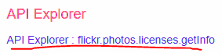

The API Explorer lets users test calls to the API to see what data is returned. The inclusion of this feature by services is entirely optional but many do it as it’s created a good developer experience. You can access `flickr.photos.licenses.getInfo` in the API Explorer at: [https://www.flickr.com/services/api/explore/flickr.photos.licenses.getInfo](https://www.flickr.com/services/api/explore/flickr.photos.licenses.getInfo)  

Even if you aren’t signed in to Flickr you can click the ‘Call Method’ button:

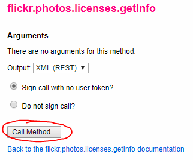

And see the following result:

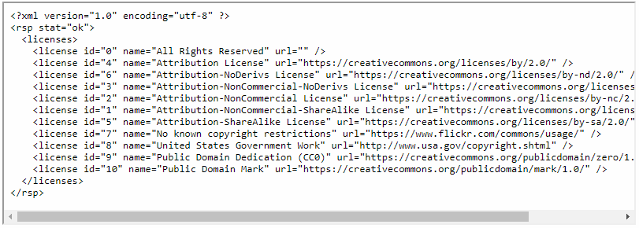

For our timeline lets exclude "All Rights Reserved" photos which are `id="0"`. To do this in column B for the `license` row add `1,2,3,4,5,6,7,8,9,10`:

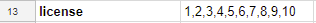

> **place_id** (Optional)
>
> A Flickr place id. (not used if bbox argument is present). 

We encounter a similar issue for the `place_id` and again we can use the API Explorer for a `flickr.places.find` method to get a `place_id`. The API explorer page for this is: [https://www.flickr.com/services/api/explore/flickr.places.find](https://www.flickr.com/services/api/explore/flickr.places.find) 

As this method has parameters these can also be added before we click the ‘Call Method’ button. For this exercise add the `query` value `London`:

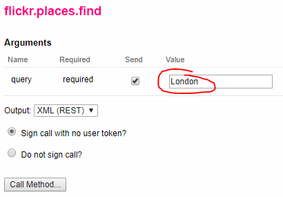

This returns a number of results sorted by relevance:

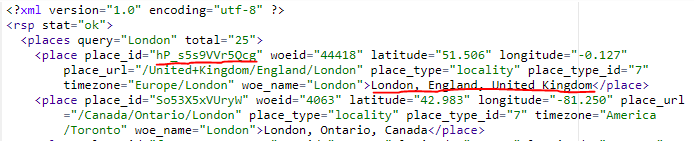

In this exercise for our timeline lets include photos that have the  `London, England, United Kingdom` place id which is `hP_s5s9VVr5Qcg`. To do this in your sheet at column B for the `place_id` row add `hP_s5s9VVr5Qcg`:

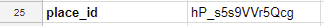

We’ve now completed all the parameters we want to add and in the API Call cell B1 your url should look like this (hopefully now you can see why we used a formula to construct this):

[`https://api.flickr.com/services/rest/?method=flickr.photos.search&api_key=4bb2dc0f5e1ef29c928d7e138c489508&tags=mozfest&license=1,2,3,4,5,6,7,8,9,10&sort=relevance&place_id=hP_s5s9VVr5Qcg&extras=date_taken,owner_name&per_page=500`](https://api.flickr.com/services/rest/?method=flickr.photos.search&api_key=4bb2dc0f5e1ef29c928d7e138c489508&tags=mozfest&license=1,2,3,4,5,6,7,8,9,10&sort=relevance&place_id=hP_s5s9VVr5Qcg&extras=date_taken,owner_name&per_page=500)

As our API call requested some `extras` we need to add some additional columns with the `IMPORTXML` formula to get these. At this point you might want to load the new url in the [Code Beautify XML Viewer](https://codebeautify.org/xmlviewer). Doing this you can see new ‘`@`’ attributes for `@ownername` and `@datetaken`.  

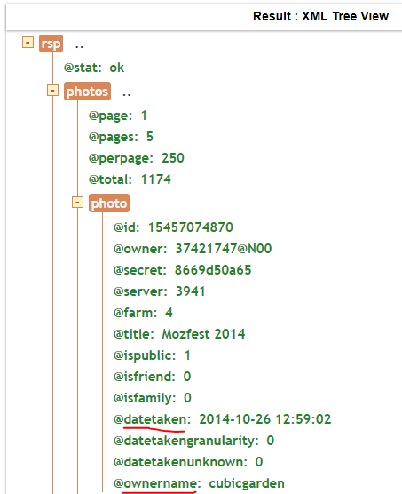

To get the data in your Google Sheet in cells H2 and I2 add the cell text:

<table>
  <tr>
    <td><b>ownername</b></td>
    <td><b>datetaken</b></td>
  </tr>
</table>

Also copy/paste one of the existing cells, E3, with the `IMPORTXML` formula to H3 and I3. Your sheet should now look like this:

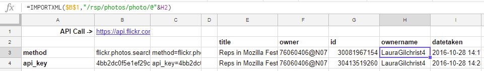

## Adding a bit of TimelineJS magic  

We now have all the data we need. To make the timeline we are going to use the open-source tool TimelineJS [https://timeline.knightlab.com/](https://timeline.knightlab.com/). TimelineJS allows you to create timelines from Google Sheets and lets you use media from a variety of sources including Flickr. 

To make our timeline there is a copy of a template provided by TimelineJS in the spreadsheet you copied for this exercise named `od1`. Opening the `od1` sheet you should see something like this:

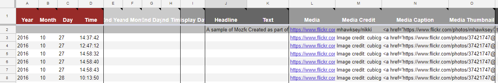

The data in this sheet is added from the `Exercise 2` sheet with some formula in row 3. Data for TimelineJS doesn’t have to be included in this way so it might be a tool you wish to explore further in your own time. 

To make the timeline we need to move the `od1` sheet so that it’s the first one in the spreadsheet (this is required by TimelineJS): 

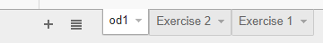

Next from the Google Sheet dropdown menu select **File > Publish to the web…** In the next window, click the blue ‘Publish’ button. When asked, "Are you sure…?" click OK. Once you have done this close the ‘Publish to web’ dialog box. 

Now open [https://timeline.knightlab.com/#make](https://timeline.knightlab.com/#make) and in step 3 copy/paste the entire url of the Google Sheet you have been working on from your browser address bar. Scroll to step 4 and click the ‘Preview’ button which should give you your completed timeline:

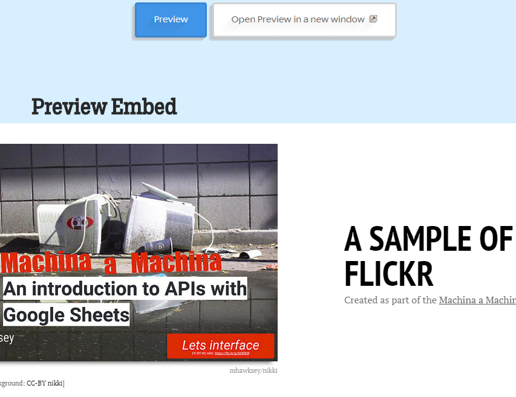

**Congratulations you are now an API Wrangler!**

# Summary

Hopefully these exercises have shown you the power of APIs. We could have gone to Flickr, searched for Mozfest tagged images and then copy/pasted 250 dates, authors, titles and URLs into a Google Sheet for TimelineJS to render. Instead by using the Flickr API we can do this saving effort and having something that is reusable, with a couple of clicks you can create timelines for other tags or searches.

As you start exploring APIs from different services you will gain insight into actually how much data is available, in many cases this data being personal information. Understanding APIs can help you decide how much information you want to share as well as creating opportunities for you to reclaim your content:   

>*APIs are affecting your life right now, and with a little more understanding you can learn to identify APIs, and put them to work for you, even if you are not a geek - Kin Lane (API Evangelist)*

# Useful Links

If you have questions you can get me @[mhawksey](https://twitter.com/mhawksey)/+[Martin Hawksey](https://profiles.google.com/mhawksey) or via my blog contact form [https://mashe.hawksey.info/contact-form/](https://mashe.hawksey.info/contact-form/) 

If you are interested in learning more about APIs I recommend to read/follow API Evangelist, Kin Lane [https://apievangelist.com/](https://apievangelist.com/). Kin has a number of great posts on [using Google Sheets with APIs](https://www.google.co.uk/search?q=site%3Aapievangelist.com+google+sheets). 

